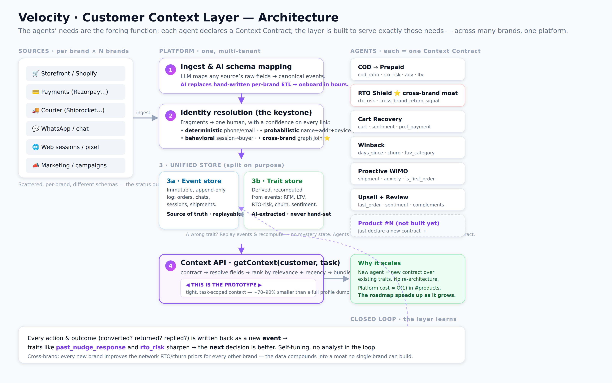

# Velocity — Customer Context Layer
### How to unify e-commerce customer data so AI agents can rely on it, across many brands
*Companion deck to the interactive prototype. The prototype proves #1/#3/#4 and shows #2; this deck carries #5 and the architecture/AI narrative behind #2.*

---

## Slide 1 · The thesis

A **CDP** answers one question: *"Who is my customer?"*

But an agent about to act doesn't need a 360° profile. It needs **the few facts that change its decision, right now.**

> We're not building a CDP. We're building the layer that answers:
> **"What does THIS agent need to know about THIS customer to do THIS job, at the moment it acts?"**
> — and stays cheap to extend as we add agents and brands.

Everything below follows from taking that sentence literally.

---

## Slide 2 · The problem, stated precisely

Velocity already runs a live WhatsApp agent and has 10 products on the roadmap (WISMO, COD→prepaid, RTO prevention, cart recovery, winback, upsell, segmentation, returns…).

Every one of them fails the same way: **the agent acts on partial context.**

- Data sits in scattered silos: storefront, payment gateway, courier, WhatsApp, web sessions, marketing tool — per brand, times N brands.
- The same human appears as 4 different records. No agent can reason about a customer it can't *resolve*.
- Each new product re-plumbs the same data from scratch → the roadmap slows down as it grows, instead of speeding up.

**The bottleneck isn't the agents. It's the context they stand on.**

---

## Slide 3 · The reframe: profile-first vs job-first

| | CDP / "profile-first" | Context Layer / "job-first" (ours) |
|---|---|---|
| Question | Who is this customer? | What does this agent need to act? |
| Output | One big profile, all fields | A tight, ranked **context bundle** per task |
| New product | Re-query, re-join, re-decide what matters | Declare a **Context Contract** over existing traits |
| Cost at the model | Whole profile in every prompt | Only the fields the job needs (≈70–90% smaller) |
| Failure mode | Noise drowns the signal; cost scales with data | Adding agents/brands stays O(1) on the platform |

The CDP is a *component inside* our layer (the unified store). The product is the **contract + resolution + serving** on top of it.

---

## Slide 4 · The method (the part I most want you to grade)

I didn't design the data model in a vacuum and hope agents could use it. **I let the agents' needs be the forcing function.**

1. List the agents we want (today's 6 + the roadmap).
2. For each, write down the literal fields it needs to make its decision.
3. The **union of those needs** defines the trait store. The **per-agent subset** defines its contract.

This is why the layer serves *products we haven't built yet*: a new agent is a new contract over traits that already exist — or a small number of new traits that the next agent can also reuse. The data model is demand-driven, not speculative.

---

## Slide 5 · Architecture (one picture)



**How to read it (left → right):**

- **Sources (per brand × N brands).** Storefront, payments, courier, WhatsApp, web pixel, marketing — scattered, each with its own schema. This is the status-quo mess.
- **① Ingest & AI schema mapping.** An LLM maps each source's raw fields onto *canonical events*, so a new brand onboards in hours instead of an ETL sprint. **AI replaces hand-written per-brand pipelines.**
- **② Identity resolution (the keystone).** Fragments collapse into one human, with a **confidence on every link** — deterministic (phone/email) → probabilistic (name+address+device, AI-scored) → behavioral (session→buyer) → **cross-brand graph join** (the moat). Nothing downstream works until this is trustworthy.
- **③ Unified store, split on purpose.** *3a Event store* = immutable, append-only facts (orders, chats, shipments) — the replayable source of truth. *3b Trait store* = derived signals (RFM, LTV, RTO-risk, churn, sentiment) **recomputed from events, never hand-set.** Splitting them is what makes a wrong trait fixable (replay & recompute) and what keeps contracts stable (agents read traits, so recomputation never breaks them).
- **④ Context API — `getContext(customer, task)`.** Takes an agent's contract, resolves the fields, ranks by relevance + recency, and returns a **tight task-scoped bundle (~70–90% smaller than a full dump).** *This is the layer the prototype implements.*
- **Agents = one Context Contract each.** Today's 6, plus *product #N (not built yet)* — which ships by declaring a new contract over existing traits. **No re-architecture; platform cost ≈ O(1) in number of products.**
- **Closed loop (bottom).** Every action + outcome is written back as a new event → traits sharpen → the next decision is better. The layer **self-tunes**, and every new brand improves the network priors for every other brand.

<details><summary>Text-only fallback (same diagram)</summary>

```
   SOURCES (per brand, many)              PLATFORM (one, multi-tenant)
 ┌───────────────────────────┐
 │ Storefront / Shopify      │            ┌────────────────────────────┐
 │ Payments (Razorpay…)      │   ingest   │ 1. INGEST + AI SCHEMA MAP  │  LLM maps any
 │ Courier (Shiprocket…)     │ ─────────► │    raw → canonical events  │  source schema
 │ WhatsApp / chat           │            └─────────────┬──────────────┘  → canonical
 │ Web sessions / pixel      │                          ▼
 │ Marketing / campaigns     │            ┌────────────────────────────┐
 └───────────────────────────┘            │ 2. IDENTITY RESOLUTION     │  deterministic +
                                          │    fragments → one person  │  probabilistic +
                                          │    (per-brand + cross-brand│  behavioral (AI)
                                          └─────────────┬──────────────┘
                                                        ▼
                        ┌───────────────────────────────────────────────┐
                        │ 3a. EVENT STORE (immutable log: orders, chats, │
                        │     sessions, shipments — append-only, replay) │
                        │ 3b. TRAIT STORE (derived: RFM, RTO risk, churn,│
                        │     sentiment, segment — recomputed from events)│
                        └─────────────┬─────────────────────────────────┘
                                      ▼
                        ┌───────────────────────────────────────────────┐
                        │ 4. CONTEXT API  getContext(customer, task)     │
                        │    contract → resolve → rank → bundle (+fresh) │ ◄── the prototype
                        └─────────────┬─────────────────────────────────┘
                                      ▼
              Agents: WISMO · COD→Prepaid · RTO Shield · Cart · Winback · Upsell · …(n)
```

</details>

The prototype is layer **4** (and the visible parts of 2). Layers 1–3 are the deck's job to describe.

---

## Slide 6 · #1 Unify, part 1 — Identity resolution (the keystone)

Nothing downstream works until "4 records → 1 human." Three escalating signals, AI-graded:

1. **Deterministic** — exact phone/email/account match. High precision, does ~70% of the work.
2. **Probabilistic (AI)** — fuzzy name + address + device, scored by a model. "P. Sharma" + same address + same device ≈ "Priya Sharma". Every link carries a **confidence**, never a silent merge.
3. **Behavioral** — an anonymous session tied to a known buyer by device + geo + browse pattern.

Output is an **identity graph** with a confidence per edge. Low-confidence merges are held for review, not auto-joined — wrong merges are worse than missed ones.

**Cross-brand is the same machinery, one level up:** the same phone across Aurelia + Kettle + Voxa is one node in Velocity's graph even though no single brand can see it. *(This is the moat — slide 10.)*

---

## Slide 7 · #1 Unify, part 2 — Why two stores, not one

**Event store (immutable):** every order, message, session, shipment as an append-only fact. Source of truth. Replayable.

**Trait store (derived):** RFM, AOV, LTV, RTO-risk, churn-score, sentiment, segment — *recomputed from events*, never hand-set.

Why split them:
- **Trust & auditability** — a trait is wrong? Replay the events and recompute. No mystery state.
- **Schema stability** — new agents read *traits*, not raw tables. We can change how a trait is computed without breaking any agent.
- **This is what makes contracts cheap** — a contract is just a list of trait/event keys. Adding a trait never breaks an existing contract.

---

## Slide 8 · #2 AI-first — where AI does the work, not rules or humans

We push the manual/rules work onto models at five points:

| Where | Today (manual/rules) | With AI |
|---|---|---|
| **Ingestion** | Engineers hand-map each brand's CSV/API schema | LLM maps any source schema → canonical events. New brand onboards in hours, not a sprint. |
| **Identity** | Exact-match rules only; rest dropped | Probabilistic matcher scores fuzzy links with confidence |
| **Traits** | Analysts define segments in SQL | Model extracts sentiment, intent, anxiety, RTO-risk from raw events |
| **Segmentation** | Marketer writes SQL / waits on data team | **Plain English → live segment** *(shown in prototype)* |
| **Action** | Templated, static copy | Per-customer message generated from the task bundle *(shown in prototype)* |

The prototype demonstrates the last two live. The deck claims the first three — same pattern, applied earlier in the pipeline.

---

## Slide 9 · #3 Features — today's 6, then what brands *don't* have

**Built on the layer today (in the prototype):** COD→Prepaid · RTO Shield · Cart Recovery · Winback · Proactive WIMO · Upsell+Review. Each is just a contract + decision logic + message.

**New capabilities the layer unlocks that brands can't do today:**

- **Anticipatory, not reactive** — WIMO that messages *before* the customer asks, because we see "in transit + first order + 2 prior anxious chats."
- **Cross-brand cold-start** — a brand-new customer to Brand X already has an RTO-risk prior from their behavior on Brands Y/Z. Day-one intelligence.
- **Self-tuning agents** — every send + outcome (converted? returned? replied?) writes back as an event → traits like `past_nudge_response` sharpen the next decision. The layer *learns*.
- **One agent, many jobs** — the same customer flows through whichever contract fits the current moment; no per-product data project.

---

## Slide 10 · #3/#4 — The cross-brand moat

A single brand sees Vikram place one COD order and return it. Annoying, not a pattern.

**Velocity sees Vikram across three brands: 4 of 5 orders returned.** Now the *next* COD order — at a brand he's never bought from — gets COD paused and prepay required *before we ship at a loss.*

- No individual brand can build this. It only exists because we're **one platform serving many brands.**
- It compounds: every brand that joins makes the RTO/churn priors better for every other brand.
- This is the defensibility. The data layer isn't a cost center — **it's the network effect.**

---

## Slide 11 · #4 Scale — the Context Contract is the whole trick

```
New product on the roadmap?  →  Write a contract.  →  Ship.
   (not: design a schema, build a pipeline, re-resolve identity)
```

- A contract is a small declarative list of trait/event keys + decision logic.
- It reads the **existing** trait store. 90% of the time it needs zero new data.
- When it needs a new trait, that trait is computed once from events and is then available to *every future* agent.

**Result:** platform cost is roughly O(1) in number of products. The roadmap accelerates as it grows instead of bogging down — the opposite of the "re-plumb every time" status quo.

---

## Slide 12 · #4 Scale — multi-tenancy & governance (the unglamorous part that decides if this is real)

- **Tenant isolation by default** — every event/trait is brand-scoped; agents read only their brand's data.
- **Cross-brand is a privileged, governed join** — network signals (RTO/churn priors) are shared as *derived scores*, never raw PII across brands. A brand never sees another brand's order; it sees "elevated network RTO risk."
- **Consent & data residency** — India DPDP-aware; per-brand consent flags travel with the customer; PII minimized in prompts (the contract already limits what reaches the model).
- **Auditability** — because traits are recomputed from the event log, every agent decision is explainable after the fact.

---

## Slide 13 · #5 — What I'd build first (and why)

Prioritized by **value × data-readiness × reversibility-of-risk.** Build where the data is already clean and the downside of a wrong action is low; defer where it isn't.

**Phase 0 — Foundation (weeks 0–4).** Identity resolution + event store + trait store + Context API.
*Why first: everything else is worthless without it, and it's the highest-leverage, lowest-glamour work. No agent ships until "4 records → 1 human" is trustworthy.*

**Phase 1 — High-value, low-regret agents (weeks 4–8).**
1. **Proactive WIMO** — data is already clean (order + shipment status), worst case is a friendly extra message. Near-zero downside, immediate CX win, extends the agent that's already live.
2. **Cart Recovery** — strong signal (live cart), reversible, fast revenue.
3. **COD→Prepaid** — direct margin impact; the nudge is low-risk even when the model is wrong.

**Phase 2 — Higher-stakes, needs more history (weeks 8–16).**
4. **RTO Shield (incl. cross-brand)** — highest revenue protection, but pausing COD on a *good* customer is a costly false positive. Ship only once the RTO model and cross-brand graph have enough volume to trust.
5. **Winback** — needs ≥6–12 months of history per cohort to size offers correctly.
6. **Upsell + Review** — easy, but lower urgency; good "fast follow."

---

## Slide 14 · #5 — What I'd deliberately defer (and why)

| Deferred | Why later |
|---|---|
| **Fully autonomous send** (no human in loop) | Earn trust first with suggestion-mode + sampled review. Autonomy is a dial, not a launch toggle. |
| **Broad marketing broadcasts** | High blast radius, low per-message intelligence — it's the *least* differentiated use of the layer. Do the 1:1 agents first; broadcasts are easy to bolt on once segments are trusted. |
| **Returns/refunds adjudication** | Touches money + policy + emotion. Needs governance and brand-specific rules before AI decides. |
| **Self-serve "build your own agent"** for brands | Powerful, but only after the contract format and trait catalog have stabilized on our own 6 agents. |
| **Deep ML retraining infra** | Pre-computed/heuristic traits are good enough to ship Phases 1–2. Build the ML platform when a trait's accuracy is the actual bottleneck — not before. |

**The senior signal is the restraint:** the prototype itself has no DB, no auth, no real integrations — on purpose. Knowing what *not* to build in a 1–2 day window is the same muscle as knowing what to defer on the roadmap.

---

## Slide 15 · Risks & honest open questions

- **Identity false-merges** — mitigated by confidence thresholds + human review of low-confidence joins; we tune for precision over recall early.
- **Cross-brand privacy** — share derived scores, never raw PII; needs legal sign-off per DPDP before GA.
- **Cold-start for tiny brands** — network priors help, but a brand with 50 orders won't have stable traits; fall back to platform-wide priors + conservative actions.
- **Model cost at scale** — the contract (small payloads) is itself the cost control; cache traits, batch trait extraction, reserve live generation for high-value moments.

---

## Slide 16 · The one line

> Today's WhatsApp agent gets smarter the day this layer ships.
> Every future agent just declares a contract over the same data.
> And because it's one platform across many brands, the data compounds into a moat no single brand can build.

**The prototype makes that clickable. This deck is how it scales.**
